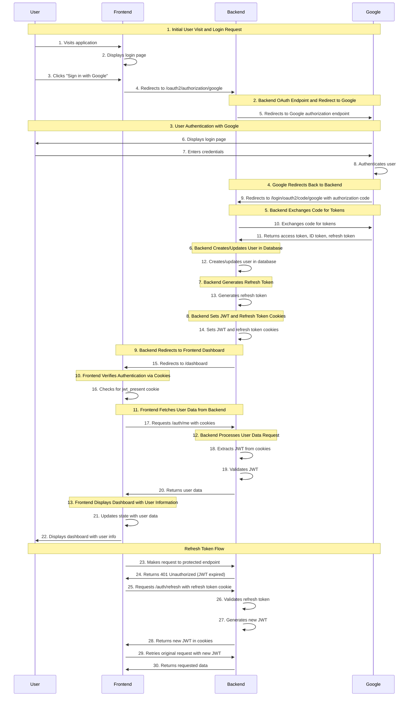

# EatsAdvisor Authentication Flow

This document provides a detailed breakdown of the authentication process in the EatsAdvisor application, from initial user visit to viewing the dashboard. It includes all token types, redirections between frontend, backend, and Google OAuth, and specific code references.

## Authentication Flow Overview

The EatsAdvisor application uses OAuth 2.0 and OpenID Connect (OIDC) for authentication, with Google as the identity provider. The flow follows these main steps:

1. User visits the application and clicks "Sign in with Google"
2. Frontend redirects to backend OAuth endpoint
3. Backend redirects to Google for authentication
4. User authenticates with Google
5. Google redirects back to backend with authorization code
6. Backend exchanges code for tokens with Google
7. Backend creates/updates user in database
8. Backend sets JWT and refresh token cookies
9. Backend redirects to frontend dashboard
10. Frontend verifies authentication via cookies
11. Frontend fetches user data from backend
12. Frontend displays dashboard with user information

## Detailed Flow Breakdown

### 1. Initial User Visit and Login Request

When a user visits the application, they are presented with a login page that includes a "Sign in with Google" button.

**File: `Client/src/pages/Login.tsx`**
```typescript
export default function Login() {
  const { login } = useAuth();

  return (
    <div>
      <h1>Login</h1>
      <button onClick={login}>Sign in with Google</button>
    </div>
  );
}
```

When the user clicks the "Sign in with Google" button, the `login()` function from the `useAuth` hook is called.

**File: `Client/src/hooks/useAuth.ts` (Lines 47-50)**
```typescript
const login = () => {
  console.log('[useAuth] Redirecting to Google OAuth login')
  window.location.href = `${api.defaults.baseURL}/oauth2/authorization/google`
}
```

### 2. Backend OAuth Endpoint and Redirect to Google

The frontend redirects the user to the backend's OAuth endpoint (`/oauth2/authorization/google`). This endpoint is handled by Spring Security's OAuth2 client configuration.

**File: `Server/src/main/java/com/eatsadvisor/eatsadvisor/config/SecurityConfig.java` (Lines 36-40)**
```java
.oauth2Login(oauth2 -> oauth2
        .successHandler(new OAuth2LoginSuccessHandler(
                appUserRepository, refreshTokenService)))
```

Spring Security's OAuth2 client then redirects the user to Google's authorization endpoint with the appropriate client ID, scope, and redirect URI parameters.

### 3. User Authentication with Google

The user is presented with Google's login page and authenticates with their Google account. This step happens entirely on Google's servers.

### 4. Google Redirects Back to Backend

After successful authentication, Google redirects the user back to the backend's redirect URI (`/login/oauth2/code/google`) with an authorization code.

### 5. Backend Exchanges Code for Tokens

Spring Security's OAuth2 client automatically exchanges the authorization code for access and ID tokens from Google's token endpoint.

**File: `Server/src/main/java/com/eatsadvisor/eatsadvisor/config/OAuth2LoginSuccessHandler.java` (Lines 29-77)**

The `onAuthenticationSuccess` method is called when the authentication is successful. It receives the authentication object that contains the user's information and tokens.

```java
@Override
@Transactional
public void onAuthenticationSuccess(HttpServletRequest request, HttpServletResponse response,
        Authentication authentication) throws IOException, ServletException {
    System.out.println("✅ OAuth2LoginSuccessHandler: Authentication successful");
    
    if (!(authentication.getPrincipal() instanceof OAuth2User)) {
        System.out.println("❌ OAuth2LoginSuccessHandler: Principal is not an OAuth2User");
        response.sendRedirect("http://localhost:3001/login?error=invalid_authentication");
        return;
    }
    
    OAuth2User oauthUser = (OAuth2User) authentication.getPrincipal();
    String email = oauthUser.getAttribute("email");
    String oauthProvider = "google"; // Hardcoded for now
    
    // ... rest of the method
}
```

### 6. Backend Creates/Updates User in Database

The backend creates or updates the user in the database based on the information received from Google.

**File: `Server/src/main/java/com/eatsadvisor/eatsadvisor/config/OAuth2LoginSuccessHandler.java` (Lines 45-54)**
```java
// Create or retrieve user
Optional<AppUser> existingUser = appUserRepository.findByEmail(email);
AppUser user = existingUser.orElseGet(() -> {
    System.out.println("✅ OAuth2LoginSuccessHandler: Creating new user");
    AppUser newUser = new AppUser();
    newUser.setEmail(email);
    newUser.setOauthProvider(oauthProvider);
    newUser.setOauthProviderId(oauthUser.getAttribute("sub"));
    return appUserRepository.save(newUser);
});
```

### 7. Backend Generates Refresh Token

The backend generates a refresh token for the user and stores it in the database.

**File: `Server/src/main/java/com/eatsadvisor/eatsadvisor/config/OAuth2LoginSuccessHandler.java` (Lines 56-57)**
```java
// Generate and store refresh token
String refreshToken = refreshTokenService.createRefreshToken(Long.valueOf(user.getId()));
```

### 8. Backend Sets JWT and Refresh Token Cookies

The backend extracts the JWT from the ID token received from Google and sets it as an HTTP-only cookie. It also sets a non-HTTP-only cookie for frontend detection and the refresh token as an HTTP-only cookie.

**File: `Server/src/main/java/com/eatsadvisor/eatsadvisor/config/OAuth2LoginSuccessHandler.java` (Lines 59-93)**
```java
// Get JWT from the OIDC user (if available)
String jwt = null;
if (oauthUser.getAttributes().containsKey("id_token")) {
    jwt = (String) oauthUser.getAttributes().get("id_token");
} else if (authentication instanceof OAuth2AuthenticationToken) {
    // Try to get the ID token from the authentication
    OAuth2AuthenticationToken oauth2Auth = (OAuth2AuthenticationToken) authentication;
    if (oauth2Auth.getPrincipal() instanceof OidcUser) {
        OidcUser oidcUser = (OidcUser) oauth2Auth.getPrincipal();
        jwt = oidcUser.getIdToken().getTokenValue();
    }
}

if (jwt == null) {
    // If no JWT is available, generate one using the refresh token
    System.out.println("⚠️ OAuth2LoginSuccessHandler: No JWT found, generating one");
    jwt = refreshTokenService.generateNewJwt(refreshToken);
}

// Set JWT as a cookie
Cookie jwtCookie = new Cookie("jwt", jwt);
jwtCookie.setHttpOnly(true);
jwtCookie.setSecure(false); // We're not using HTTPS in development
jwtCookie.setPath("/");
jwtCookie.setMaxAge(3600); // 1 hour
jwtCookie.setAttribute("SameSite", "Lax"); // Changed from None to Lax for non-HTTPS
response.addCookie(jwtCookie);

// Add a non-HttpOnly cookie for frontend detection
Cookie jwtIndicatorCookie = new Cookie("jwt_present", "true");
jwtIndicatorCookie.setHttpOnly(false);
jwtIndicatorCookie.setSecure(false); // We're not using HTTPS in development
jwtIndicatorCookie.setPath("/");
jwtIndicatorCookie.setMaxAge(3600); // 1 hour
jwtIndicatorCookie.setAttribute("SameSite", "Lax"); // Changed from None to Lax for non-HTTPS
response.addCookie(jwtIndicatorCookie);

// Set refresh token as an HTTP-only cookie
Cookie refreshCookie = new Cookie("refresh_token", refreshToken);
refreshCookie.setHttpOnly(true);
refreshCookie.setSecure(false); // We're not using HTTPS in development
refreshCookie.setPath("/");
refreshCookie.setMaxAge(7 * 24 * 60 * 60); // 7 days
refreshCookie.setAttribute("SameSite", "Lax"); // Changed from None to Lax for non-HTTPS
response.addCookie(refreshCookie);
```

### 9. Backend Redirects to Frontend Dashboard

The backend redirects the user to the frontend dashboard.

**File: `Server/src/main/java/com/eatsadvisor/eatsadvisor/config/OAuth2LoginSuccessHandler.java` (Lines 95-96)**
```java
// Redirect directly to frontend dashboard
response.sendRedirect("http://localhost:3001/dashboard");
```

### 10. Frontend Verifies Authentication via Cookies

When the frontend loads the dashboard, it checks for the presence of the `jwt_present` cookie to determine if the user is authenticated.

**File: `Client/src/hooks/useAuth.ts` (Lines 12-14, 22-30)**
```typescript
// Helper function to check if jwt_present cookie exists
const hasJwtCookie = (): boolean => {
  return document.cookie.split(';').some(cookie => cookie.trim().startsWith('jwt_present='))
}

// ...

// Check for jwt_present cookie
const jwtPresent = hasJwtCookie()
console.log('[useAuth] JWT Cookie present:', jwtPresent)

if (!jwtPresent) {
  console.log('[useAuth] No JWT cookie found, user not authenticated')
  setUser(null)
  setLoading(false)
  return
}
```

### 11. Frontend Fetches User Data from Backend

If the `jwt_present` cookie is present, the frontend makes a request to the backend's `/auth/me` endpoint to fetch the user's data.

**File: `Client/src/hooks/useAuth.ts` (Lines 32-46)**
```typescript
const response = await api.get('/auth/me', { withCredentials: true })

console.log('[useAuth] Response:', response.status, response.data)

if (response.status === 200 && isMounted) {
  console.log('[useAuth] User authenticated:', response.data)
  setUser(response.data)
} else if (isMounted) {
  console.log('[useAuth] User not authenticated, setting null')
  setUser(null)
}
```

### 12. Backend Processes User Data Request

The backend receives the request to `/auth/me` and extracts the JWT from the cookies. It then validates the JWT and returns the user's data.

**File: `Server/src/main/java/com/eatsadvisor/eatsadvisor/controllers/AuthController.java` (Lines 149-190)**
```java
@GetMapping("/me")
public ResponseEntity<?> getUserInfo() {
    Authentication authentication = SecurityContextHolder.getContext().getAuthentication();

    System.out.println("🔍 Checking authentication: " + authentication);

    if (authentication == null || !authentication.isAuthenticated()
            || authentication.getPrincipal().equals("anonymousUser")) {
        System.out.println("❌ User is not authenticated");
        return ResponseEntity.status(401).body("Not authenticated");
    }

    // Handle OidcUser (direct OAuth login)
    if (authentication.getPrincipal() instanceof OidcUser oidcUser) {
        System.out.println("✅ Authenticated user (OIDC): " + oidcUser.getEmail());

        Map<String, String> userInfo = new HashMap<>();
        userInfo.put("email", oidcUser.getEmail());
        
        // Split the full name into first and last name if available
        String fullName = oidcUser.getFullName();
        if (fullName != null && !fullName.isEmpty()) {
            String[] nameParts = fullName.split(" ", 2);
            userInfo.put("firstName", nameParts[0]);
            if (nameParts.length > 1) {
                userInfo.put("lastName", nameParts[1]);
            }
        }
        
        return ResponseEntity.ok(userInfo);
    }
    
    // Handle JWT authentication
    if (authentication.getPrincipal() instanceof Jwt jwt) {
        System.out.println("✅ Authenticated user (JWT): " + jwt.getSubject());
        
        Map<String, String> userInfo = new HashMap<>();
        userInfo.put("email", jwt.getClaimAsString("email"));
        
        // Get name from JWT claims
        String fullName = jwt.getClaimAsString("name");
        if (fullName != null && !fullName.isEmpty()) {
            String[] nameParts = fullName.split(" ", 2);
            userInfo.put("firstName", nameParts[0]);
            if (nameParts.length > 1) {
                userInfo.put("lastName", nameParts[1]);
            }
        }
        
        return ResponseEntity.ok(userInfo);
    }

    System.out.println("❌ Unknown authentication type: " + authentication.getClass().getName());
    return ResponseEntity.status(401).body("Invalid authentication");
}
```

### 13. Frontend Displays Dashboard with User Information

The frontend receives the user data and displays the dashboard with the user's information.

**File: `Client/src/pages/Dashboard.tsx` (Lines 31-33)**
```typescript
<h1 className="text-3xl font-bold text-center mb-4">
  Welcome, {user?.firstName || user?.email || "Guest"}!
</h1>
```

## Refresh Token Flow

When the JWT expires, the frontend can use the refresh token to get a new JWT without requiring the user to log in again.

### 1. Frontend Detects Expired JWT

When the frontend makes a request to a protected endpoint and receives a 401 Unauthorized response, it can attempt to refresh the JWT using the refresh token.

### 2. Frontend Requests New JWT

The frontend makes a request to the backend's `/auth/refresh` endpoint.

### 3. Backend Validates Refresh Token

The backend extracts the refresh token from the cookies and validates it.

**File: `Server/src/main/java/com/eatsadvisor/eatsadvisor/controllers/AuthController.java` (Lines 25-39)**
```java
@PostMapping("/refresh")
public void refreshToken(HttpServletRequest request, HttpServletResponse response) throws IOException {
    String refreshToken = null;
    if (request.getCookies() != null) {
        for (Cookie cookie : request.getCookies()) {
            if ("refresh_token".equals(cookie.getName())) {
                refreshToken = cookie.getValue();
            }
        }
    }

    if (refreshToken == null || !refreshTokenService.validateRefreshToken(refreshToken)) {
        response.sendError(HttpServletResponse.SC_UNAUTHORIZED, "Invalid Refresh Token");
        return;
    }

    // ... rest of the method
}
```

### 4. Backend Generates New JWT

If the refresh token is valid, the backend generates a new JWT and sets it as a cookie.

**File: `Server/src/main/java/com/eatsadvisor/eatsadvisor/controllers/AuthController.java` (Lines 41-59)**
```java
// Generate a new JWT
String newJwt = refreshTokenService.generateNewJwt(refreshToken);
Cookie jwtCookie = new Cookie("jwt", newJwt);
jwtCookie.setHttpOnly(true);
jwtCookie.setSecure(false); // We're not using HTTPS in development
jwtCookie.setPath("/");
jwtCookie.setMaxAge(3600);
jwtCookie.setAttribute("SameSite", "Lax"); // Changed from None to Lax for non-HTTPS
response.addCookie(jwtCookie);

// Add a non-HttpOnly cookie for frontend detection
Cookie jwtIndicatorCookie = new Cookie("jwt_present", "true");
jwtIndicatorCookie.setHttpOnly(false);
jwtIndicatorCookie.setSecure(false); // We're not using HTTPS in development
jwtIndicatorCookie.setPath("/");
jwtIndicatorCookie.setMaxAge(3600);
jwtIndicatorCookie.setAttribute("SameSite", "Lax"); // Changed from None to Lax for non-HTTPS
response.addCookie(jwtIndicatorCookie);
```

### 5. Frontend Retries Original Request

With the new JWT, the frontend can retry the original request that failed due to the expired JWT.

## Sequence Diagram



## OIDC Terms and Concepts

- **OpenID Connect (OIDC)**: An identity layer on top of OAuth 2.0 that allows clients to verify the identity of end-users.
- **OAuth 2.0**: An authorization framework that enables third-party applications to obtain limited access to a user's account on an HTTP service.
- **Authorization Code Flow**: The flow used in this application, where the client (backend) receives an authorization code from the authorization server (Google) and exchanges it for tokens.
- **ID Token**: A JWT containing claims about the authentication of an end-user by an authorization server. In this application, it's used as the JWT for authentication.
- **Access Token**: A token used to access protected resources. In this application, it's used to access Google APIs.
- **Refresh Token**: A token used to obtain new access tokens when the current access token expires. In this application, it's used to obtain new JWTs.
- **JWT (JSON Web Token)**: A compact, URL-safe means of representing claims to be transferred between two parties. In this application, it's used for authentication.
- **Claims**: Statements about an entity (typically, the user) and additional data. In this application, claims like email and name are extracted from the ID token.
- **Scope**: The scope of access that the application is requesting. In this application, scopes like email and profile are requested.
- **Client ID**: The identifier for the application. In this application, it's the Google OAuth client ID.
- **Client Secret**: The secret known only to the application and the authorization server. In this application, it's the Google OAuth client secret.
- **Redirect URI**: The URI to which the authorization server will redirect the user after authentication. In this application, it's `/login/oauth2/code/google`.
