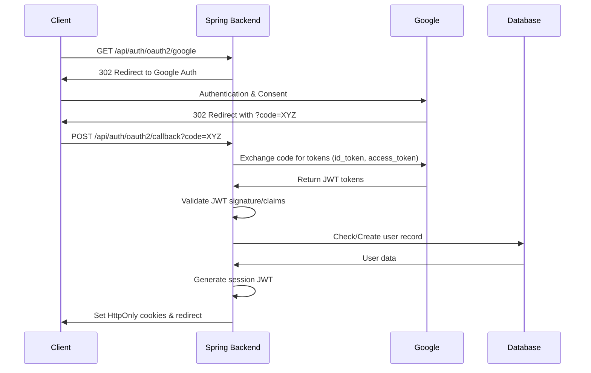

# Google OAuth2 Login Process Flow

## Sequence Diagram



## Detailed Flow Breakdown

### 1. Initial OAuth2 Request Handling (`AuthController.java`)
```java
@GetMapping("/oauth2/google")
public void oauth2Redirect(HttpServletResponse response) {
    // Configured in SecurityConfig.oauth2Client()
    // Uses ClientRegistrationRepository to build Google OAuth2 URL
    response.sendRedirect(oauth2AuthorizationRequestResolver.resolve());
}
```

### 2. Google Authentication
- Client redirected to `https://accounts.google.com/o/oauth2/v2/auth`
- Parameters include:
  - `client_id`: From application.properties
  - `redirect_uri`: Configured in Google Cloud Console
  - `scope`: openid email profile
  - `state`: CSRF token generated by Spring Security

### 3. Authorization Code Handling (`OAuth2LoginSuccessHandler.java`)
```java
public void onAuthenticationSuccess(...) {
    OAuth2User oAuth2User = authentication.getPrincipal();
    Map<String, Object> attributes = oAuth2User.getAttributes();
    
    // User synchronization logic
    AppUser user = appUserService.processOAuth2User(
        attributes.get("email"),
        (String) attributes.get("given_name"),
        (String) attributes.get("family_name")
    );
    
    // JWT generation
    String accessToken = jwtUtils.generateToken(user);
    String refreshToken = refreshTokenService.createRefreshToken(user.getId());
    
    // Cookie setup
    addSecureCookie(response, "access_token", accessToken);
    addSecureCookie(response, "refresh_token", refreshToken);
    
    response.sendRedirect(frontendUrl);
}
```

### 4. Token Validation & User Sync (`AppUserService.java`)
```java
public AppUser processOAuth2User(String email, String firstName, String lastName) {
    return userRepository.findByEmail(email)
        .map(user -> updateExistingUser(user, firstName, lastName))
        .orElseGet(() -> registerNewUser(email, firstName, lastName));
}

private AppUser registerNewUser(...) {
    AppUser newUser = new AppUser();
    newUser.setEmail(email);
    newUser.setProfile(new Profile(firstName, lastName));
    // Sets default role from AppRoleRepository
    return userRepository.save(newUser);
}
```

### 5. Database Operations
- Schema defined in `schema.sql` includes:
```sql
CREATE TABLE app_user (
    id UUID PRIMARY KEY,
    email VARCHAR(255) UNIQUE,
    profile_id UUID REFERENCES profile(id),
    created_at TIMESTAMPTZ DEFAULT NOW()
);

CREATE TABLE refresh_token (
    id UUID PRIMARY KEY,
    user_id UUID REFERENCES app_user(id),
    expiry_date TIMESTAMPTZ NOT NULL
);
```

### 6. Security Headers & Cookie Configuration (`SecurityConfig.java`)
```java
http.oauth2Login()
    .successHandler(oAuth2LoginSuccessHandler)
    .and()
    .csrf().csrfTokenRepository(CookieCsrfTokenRepository.withHttpOnlyFalse())
    .and()
    .sessionManagement()
    .sessionCreationPolicy(SessionCreationPolicy.STATELESS);
```

## Security Considerations

1. **CSRF Protection**:
   - State parameter in OAuth2 flow
   - Double Submit Cookie pattern via Spring's CsrfFilter

2. **Cookie Security**:
```java
private void addSecureCookie(...) {
    ResponseCookie cookie = ResponseCookie.from(name, token)
        .httpOnly(true)
        .secure(true)
        .path("/")
        .maxAge(Duration.ofDays(30))
        .sameSite("Lax")
        .build();
    response.addHeader(HttpHeaders.SET_COOKIE, cookie.toString());
}
```

3. **JWT Validation**:
   - Verifies signature using Google's public JWKS
   - Validates `aud`, `iss`, `exp` claims
   - Uses HS256 for backend-generated JWTs

4. **Database Security**:
   - Passwordless authentication (OAuth2 only)
   - Refresh tokens encrypted via Jasypt
   - Audit fields (created_at, updated_at)

5. **OWASP Compliance**:
   - Input validation on email/name fields
   - Rate limiting on /api/auth endpoints
   - HSTS configuration in SecurityConfig
   - SQL injection prevention via JPA repositories
