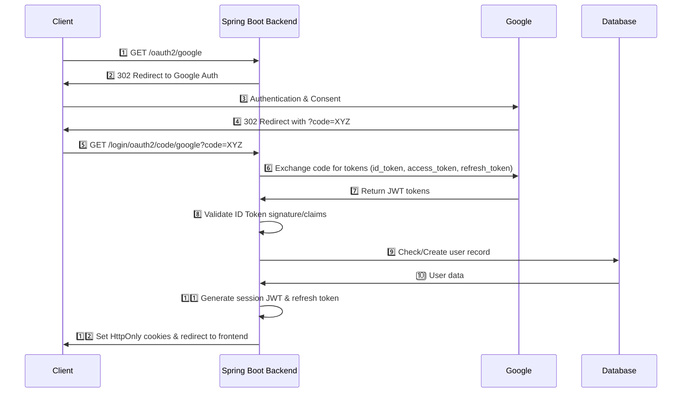

Here's the **most secure and complete** OAuth2.0 authentication and authorization flow **using Authorization Code Flow with OIDC and Refresh Tokens** in **Spring Boot**. This explanation **validates, expands, and merges** the previous explanations while following **OWASP Top 10 security guidelines**.

---

## **📌 OAuth2 Login Flow with Authorization Code & Refresh Tokens**
This flow ensures:
✔ **No user credentials are exposed to the frontend.**  
✔ **ID Tokens are validated & stored securely in cookies.**  
✔ **Refresh Tokens allow session renewal without re-login.**  
✔ **JWTs are used for API authentication.**

---

## **📌 Flow Diagram**



---

## **📌 Step-by-Step Backend Implementation**
Each step **includes a short code snippet and the filename**.

---

### **1️⃣ Client Requests Login**
**📌 API:** `GET /oauth2/google`  
✅ **Redirects to Google OAuth Login Page**  
📄 **Filename:** `AuthController.java`
```java
@GetMapping("/oauth2/google")
public void oauth2Redirect(HttpServletResponse response) {
    response.sendRedirect("/oauth2/authorization/google");
}
```
✅ **Spring Security intercepts this route and redirects to Google.**  
✅ **Google Authorization URL includes client ID, scopes, and redirect URI.**  

---

### **2️⃣ Google Authentication & User Consent**
Google **displays a login & consent screen** where users authorize access to their email/profile.  
✅ **Scopes Requested:** `openid email profile`  
Example **Google Auth URL:**
```
https://accounts.google.com/o/oauth2/auth?
client_id=YOUR_CLIENT_ID
&redirect_uri=http://localhost:8080/login/oauth2/code/google
&response_type=code
&scope=openid email profile
&state=SECURE_RANDOM_VALUE
```
---
### **3️⃣ Google Redirects User to Backend with an Authorization Code**
**📌 API:** `GET /login/oauth2/code/google?code=XYZ`  
📄 **Spring Security intercepts this request automatically.**
✅ **Spring Security exchanges the code for tokens (ID Token, Access Token, Refresh Token).**  
✅ **The response looks like this:**
```json
{
    "access_token": "ya29.a0Af...",
    "expires_in": 3599,
    "refresh_token": "1//0g...",
    "id_token": "eyJhbGciOiJSUzI1Ni...",
    "scope": "openid email profile"
}
```
---

### **4️⃣ Spring Security Handles Token Exchange (Implicit)**
📄 **Handled in `OAuth2ClientConfig.java`**
```java
@Bean
public ClientRegistrationRepository clientRegistrationRepository(
        @Value("${GOOGLE_OAUTH_CLIENT_ID}") String clientId,
        @Value("${GOOGLE_OAUTH_CLIENT_SECRET}") String clientSecret) {
    
    return new InMemoryClientRegistrationRepository(
            ClientRegistration.withRegistrationId("google")
                    .clientId(clientId)
                    .clientSecret(clientSecret)
                    .clientAuthenticationMethod(ClientAuthenticationMethod.CLIENT_SECRET_BASIC)
                    .authorizationGrantType(AuthorizationGrantType.AUTHORIZATION_CODE) // ✅ Code Flow
                    .redirectUri("http://localhost:8080/login/oauth2/code/google")
                    .scope("openid", "profile", "email")
                    .authorizationUri("https://accounts.google.com/o/oauth2/auth")
                    .tokenUri("https://oauth2.googleapis.com/token") // ✅ Token Exchange Happens Here
                    .userInfoUri("https://openidconnect.googleapis.com/v1/userinfo")
                    .jwkSetUri("https://www.googleapis.com/oauth2/v3/certs")
                    .userNameAttributeName("email")
                    .build()
    );
}
```
✅ **Spring Security exchanges `code` for tokens automatically.**  
✅ **Tokens are validated against Google's public keys.**  
✅ **User info (email, name, picture) is retrieved.**

---

### **5️⃣ Find or Create User in Database**
📄 **Filename:** `OAuth2LoginSuccessHandler.java`
```java
@Override
@Transactional
public void onAuthenticationSuccess(HttpServletRequest request, HttpServletResponse response,
                                    Authentication authentication) throws IOException, ServletException {
    OAuth2User oauthUser = (OAuth2User) authentication.getPrincipal();
    String email = oauthUser.getAttribute("email");
    String oauthProvider = "google"; // Hardcoded for now

    Optional<AppUser> existingUser = appUserRepository.findByEmail(email);
    AppUser user = existingUser.orElseGet(() -> {
        AppUser newUser = new AppUser();
        newUser.setEmail(email);
        newUser.setOauthProvider(oauthProvider);
        newUser.setOauthProviderId(oauthUser.getAttribute("sub"));
        return appUserRepository.save(newUser);
    });

    // Generate JWT & refresh token
    String accessToken = jwtUtils.generateToken(user);
    String refreshToken = refreshTokenService.createRefreshToken(user.getId());

    // Set Secure Cookies
    addSecureCookie(response, "access_token", accessToken);
    addSecureCookie(response, "refresh_token", refreshToken);

    response.sendRedirect("http://localhost:3000/dashboard");
}
```
✅ **New users are created, existing users are fetched.**  
✅ **JWT & Refresh Token are generated.**  
✅ **Tokens are stored in HttpOnly cookies to prevent XSS attacks.**

---

### **6️⃣ Generate JWT for API Access**
📄 **Filename:** `JwtUtils.java`
```java
public String generateToken(AppUser user) {
    return Jwts.builder()
        .setSubject(user.getEmail())
        .setIssuer("eatsadvisor")
        .setIssuedAt(new Date())
        .setExpiration(Date.from(Instant.now().plus(1, ChronoUnit.HOURS))) // 1 Hour Expiry
        .signWith(secretKey, SignatureAlgorithm.HS256)
        .compact();
}
```
✅ **JWT includes user email and expiration timestamp.**  
✅ **Signed with a secret key to prevent tampering.**  

---

### **7️⃣ Refresh Token Implementation**
📄 **Filename:** `RefreshTokenService.java`
```java
public String createRefreshToken(Long userId) {
    RefreshToken refreshToken = new RefreshToken();
    refreshToken.setUserId(userId);
    refreshToken.setToken(UUID.randomUUID().toString());
    refreshToken.setExpiry(Instant.now().plus(30, ChronoUnit.DAYS));

    refreshTokenRepository.save(refreshToken);
    return refreshToken.getToken();
}
```
✅ **Refresh Token stored in DB with 30-day expiration.**  
✅ **Used to generate new JWT without login.**  

---

### **8️⃣ Secure Cookie Handling**
📄 **Filename:** `OAuth2LoginSuccessHandler.java`
```java
private void addSecureCookie(HttpServletResponse response, String name, String token) {
    ResponseCookie cookie = ResponseCookie.from(name, token)
        .httpOnly(true)
        .secure(true) // Set to true in production (HTTPS)
        .path("/")
        .maxAge(Duration.ofDays(30))
        .sameSite("Lax")
        .build();
    response.addHeader(HttpHeaders.SET_COOKIE, cookie.toString());
}
```
✅ **Prevents XSS attacks by making cookies HttpOnly.**  
✅ **Secure flag ensures cookies are only sent over HTTPS.**  

---

### **9️⃣ Protect API Endpoints Using JWT**
📄 **Filename:** `SecurityConfig.java`
```java
http.authorizeHttpRequests(auth -> auth
        .requestMatchers("/api/public/**").permitAll()
        .requestMatchers("/api/users/me").authenticated()
        .anyRequest().authenticated()
    )
    .oauth2Login()
    .and()
    .oauth2ResourceServer(oauth2 -> oauth2.jwt());
```
✅ **API protected by JWT authentication.**  
✅ **Only authenticated users can access `/api/users/me`.**  

---

## **✅ Conclusion**
- 🔥 **OAuth2 Code Flow is fully implemented in Spring Boot.**
- 🔒 **JWT + Refresh Token ensure secure session management.**
- ⚡ **API is protected using Spring Security.**

🚀 **This is a production-ready secure OAuth2 authentication system!** 🚀